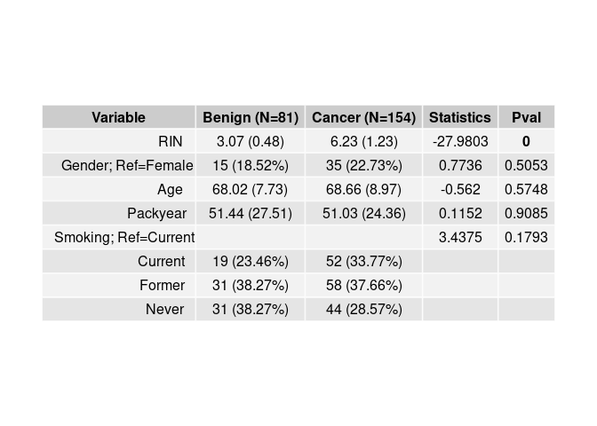

<!-- README.md is generated from README.Rmd. Please edit that file -->

# TABLEONE

The goal of TABLEONE is to generate table 1 on study sample.

Major highlights include:

  - Main variable could be variable format: continuous, binary or
    categorical (\>2 levels).
  - Perform statistical test depending on variable class:
    correlation/two-group t-test/ANOVA
  - Output resulted table in both pdf and excel format.

## Installation

`TABLEONE` can be installed from
[GitHub](https://github.com/ningb/TABLEONE) with:

``` r
# install.packages("devtools")
devtools::install_github("ningb/TABLEONE")
```

## Usage

### Generating table one with statistics

Here is a basic example. The `TABLEONE` pakcage includes a toy example
study description. We will load it and examine the varaibles association
with the cancer status:

``` r
library(TABLEONE)
data(index)
output <- tableone("Cancer", c(1:5), index)
#> [1] "RIN"
#> [1] "Gender"
#> [1] "Age"
#> [1] "Packyear"
#> [1] "Smoking"

output
#>               Variable Benign (N=81) Cancer (N=154) Statistics   Pval
#> 1                  RIN   3.07 (0.48)    6.23 (1.23)   -27.9803      0
#> 2   Gender; Ref=Female   15 (18.52%)    35 (22.73%)     0.7736 0.5053
#> 3                  Age  68.02 (7.73)   68.66 (8.97)     -0.562 0.5748
#> 4             Packyear 51.44 (27.51)  51.03 (24.36)     0.1152 0.9085
#> 5 Smoking; Ref=Current          <NA>           <NA>     3.4375 0.1793
#> 6              Current   19 (23.46%)    52 (33.77%)       <NA>   <NA>
#> 7               Former   31 (38.27%)    58 (37.66%)       <NA>   <NA>
#> 8                Never   31 (38.27%)    44 (28.57%)       <NA>   <NA>
```

### Output

`TABLEONE` includes two types of output: pdf or excel (good for
presentation and sharing):

``` r
tableone.plot(output)
```



``` r
# tableone.export(output)
```
